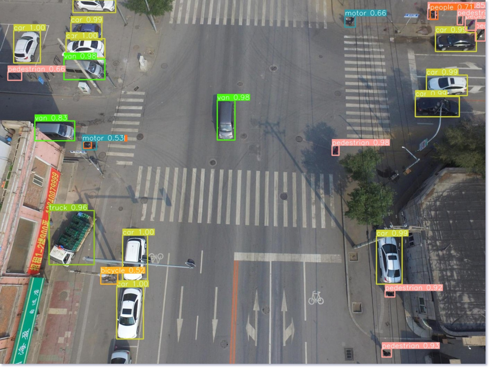

# PVG-DET
Pyramid Vision GNN + FPN for Small Object Recognition.

# Requirements
python 3.11  
torch 2.1  
torchvision 0.16  
PyQt5 5.15  
numpy  
pycocotools  
opencv-python  
tqdm

## Dataset
Download the dataset from: [COCO](https://cocodataset.org/), [VisDrone](https://github.com/VisDrone/VisDrone-Dataset).  
Please organize the dataset as follows:
```
./dataset/
    coco/
        annotations/
            instances_train2017.json
            instances_val2017.json
        images/
            train2017/
                000000000009.jpg
                ...
            val2017/
                000000000139.jpg
                ...
    visdrone/
        train/
            annotations/
                0000001_00000_d_0000001.txt
                ...
            images/
                0000001_00000_d_0000001.jpg
                ...
        val/
            annotations/
                0000001_00000_d_0000001.txt
                ...
            images/
                0000001_00000_d_0000001.jpg
                ...
```

## Train
You can train the model by running the script `./start.sh`.  
Details of the training parameters can be viewed in `./util/option.py`.

## Visualize
Here is an example of the recognition results.

